# Project overview

This project presents a reproducible single-cell RNA-sequencing analysis of colorectal cancer using the publicly available GSE132465 dataset. The analysis compares matched tumor and normal colorectal tissue samples and investigates cellular heterogeneity, changes in cell-type composition, and tumor-associated transcriptional programs.

The workflow includes quality control, normalization, principal component analysis, patient-level batch correction, UMAP visualization, graph-based clustering, broad cell-type annotation, differential cell-composition analysis, epithelial pseudobulk differential expression, and pathway enrichment analysis.

# Dataset

The selected dataset contained 39,197 cells from ten patients with matched normal and tumor samples. The raw gene-by-cell count matrix was converted into a sparse matrix representation to allow memory-efficient processing.

# Analysis workflow

The principal stages of the analysis were:

1. Data inspection and sparse-matrix conversion
2. Quality-control assessment
3. Normalization and variable-feature selection
4. Principal component analysis
5. Patient-level Harmony correction
6. Graph-based clustering and UMAP
7. Cell-type annotation using canonical markers
8. Paired cell-composition analysis
9. Epithelial pseudobulk differential-expression analysis
10. Hallmark pathway enrichment analysis

# Quality control

Quality-control metrics were examined before downstream analysis. The dataset had already undergone filtering by the original study. Cells retained for this analysis had at least 200 detected genes, at least 1,000 UMI counts, fewer than 6,000 detected genes, and less than 20% mitochondrial reads. Recalculation of these metrics did not identify additional cells requiring removal.

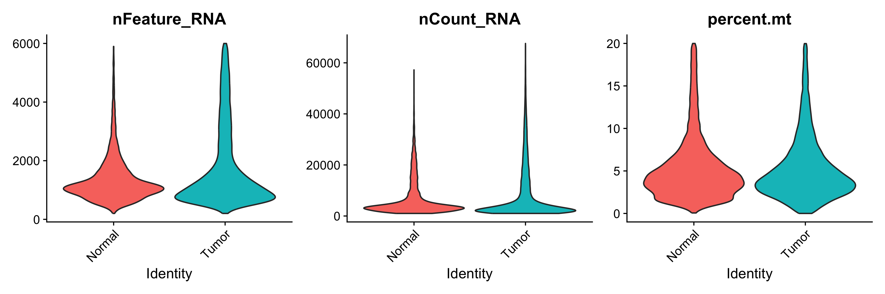{fig-alt="Distributions of detected genes, UMI counts and mitochondrial percentages in normal and tumor cells." width=100%}

The relationship between total UMI counts and the number of detected genes was also inspected.

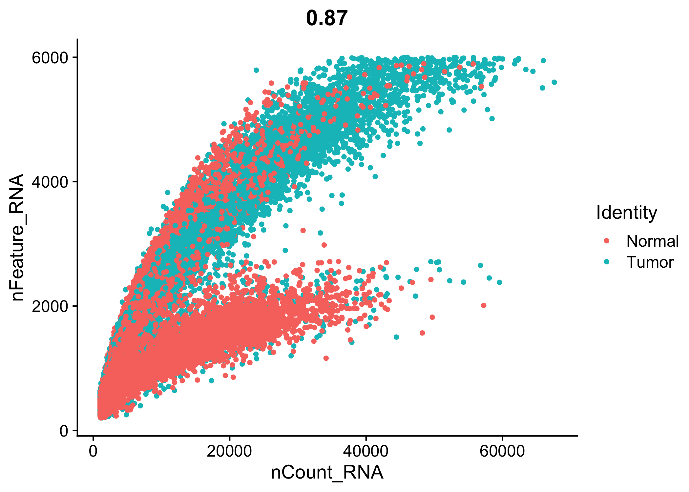{fig-alt="Relationship between UMI counts and detected genes in normal and tumor cells." width=70%}

# Normalization and dimensionality reduction

Raw counts were normalized using library-size normalization followed by log transformation. Two thousand highly variable genes were selected for dimensionality reduction.

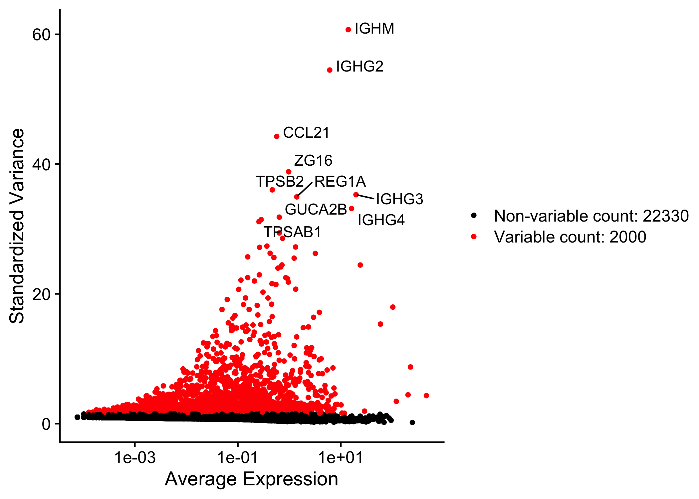{fig-alt="Highly variable genes selected for downstream analysis." width=70%}

Principal component analysis was performed using the variable genes. The elbow plot indicated that the first 30 principal components captured the major biological variation and were retained for downstream analysis.

{fig-alt="Elbow plot showing the standard deviation of the first 50 principal components." width=65%}

The initial PCA visualization showed variation associated with both tissue class and patient identity.

::: {layout-ncol=2}

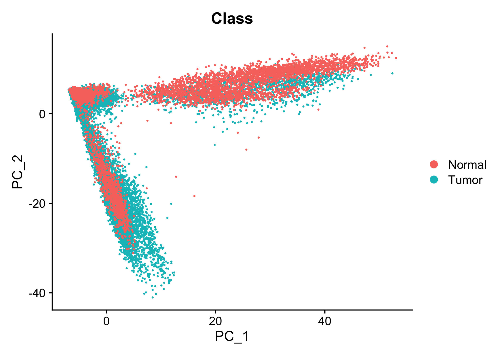{fig-alt="PCA visualization colored by normal and tumor class."}

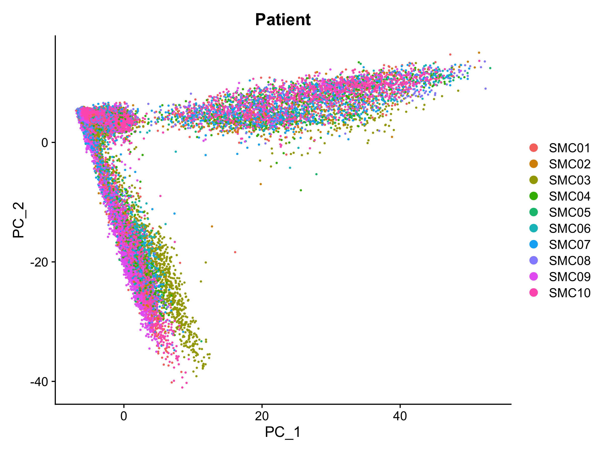{fig-alt="PCA visualization colored by patient."}

:::

# Batch correction, clustering and UMAP

Harmony integration was applied using patient identity as the batch variable. This approach was selected to reduce patient-specific variation while retaining the biological tumor-versus-normal comparison.

A shared-nearest-neighbor graph was constructed using the first 30 Harmony dimensions. Graph-based clustering at resolution 0.4 identified 21 clusters. UMAP was used for two-dimensional visualization.

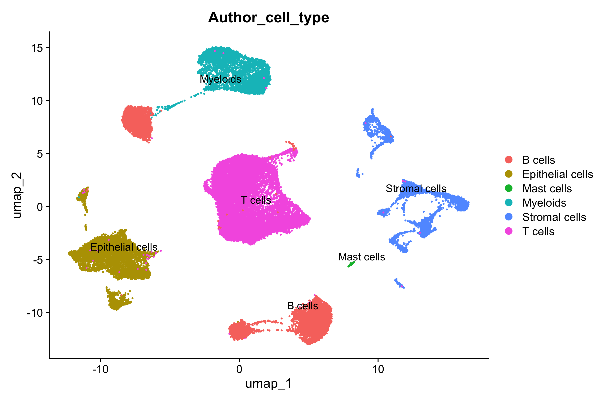{fig-alt="UMAP colored by the original broad cell-type annotations supplied by the study authors." width=70%}

# Cell-type annotation

Clusters were annotated using both the annotations provided by the original study and the expression of canonical marker genes. The following broad populations were identified:

- B cells
- T/NK cells
- Myeloid cells
- Mast cells
- Epithelial cells
- Endothelial cells
- Fibroblasts

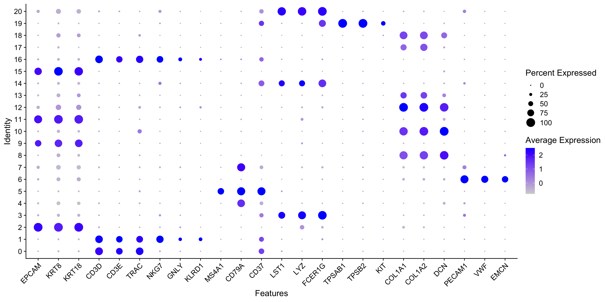{fig-alt="Dot plot showing canonical marker expression across the identified clusters." width=100%}

The final broad cell-type annotations showed clearly separated major cellular compartments.

{fig-alt="UMAP visualization of broad cell-type annotations." width=70%}

# Cell-type composition

Cell-type proportions were calculated separately for each patient and tissue class. Comparisons were restricted to the ten patients with matched normal and tumor samples. Paired Wilcoxon signed-rank tests were used, followed by Benjamini–Hochberg correction across cell types.

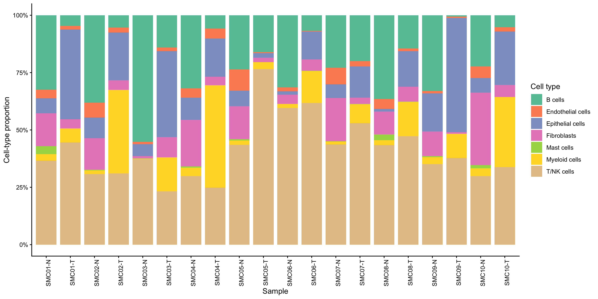{fig-alt="Cell-type composition of each matched normal and tumor sample." width=100%}

The paired visualization demonstrates the direction of the tumor-associated compositional changes within each patient.

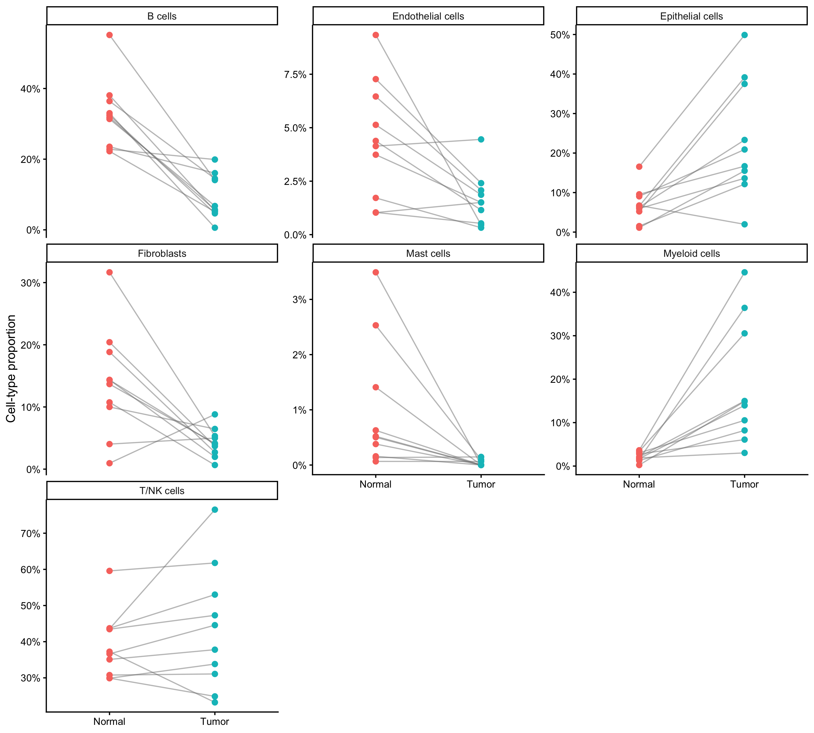{fig-alt="Paired comparison of cell-type proportions between normal and tumor samples." width=90%}

```{r}
composition_results <- read.csv(
  "results/cell_composition_statistics.csv",
  stringsAsFactors = FALSE
)

composition_table <- composition_results[
  ,
  c(
    "Broad_cell_type",
    "median_normal",
    "median_tumor",
    "median_paired_difference",
    "p_value",
    "FDR"
  )
]

composition_table$median_normal <- round(
  composition_table$median_normal,
  3
)

composition_table$median_tumor <- round(
  composition_table$median_tumor,
  3
)

composition_table$median_paired_difference <- round(
  composition_table$median_paired_difference,
  3
)

composition_table$p_value <- signif(
  composition_table$p_value,
  3
)

composition_table$FDR <- signif(
  composition_table$FDR,
  3
)

knitr::kable(
  composition_table,
  caption = "Paired cell-type composition analysis."
)
```

Tumors contained higher median proportions of epithelial and myeloid cells and lower proportions of B cells, fibroblasts, endothelial cells and mast cells. The change in the T/NK-cell proportion was not statistically significant after multiple-testing correction.

These results represent relative proportions among captured cells rather than absolute tissue abundance. Tissue dissociation, cell capture efficiency and the compositional nature of proportion data should therefore be considered when interpreting the results.

# Epithelial pseudobulk differential-expression analysis

To investigate tumor-associated transcriptional changes, epithelial cells were aggregated into patient-level pseudobulk samples. Patients were retained only when both their normal and tumor samples contained at least 20 epithelial cells. This resulted in eight matched patient pairs and sixteen pseudobulk samples.

The multidimensional scaling plot shows the relationships among the pseudobulk samples. Lines connect the matched normal and tumor samples from each patient.

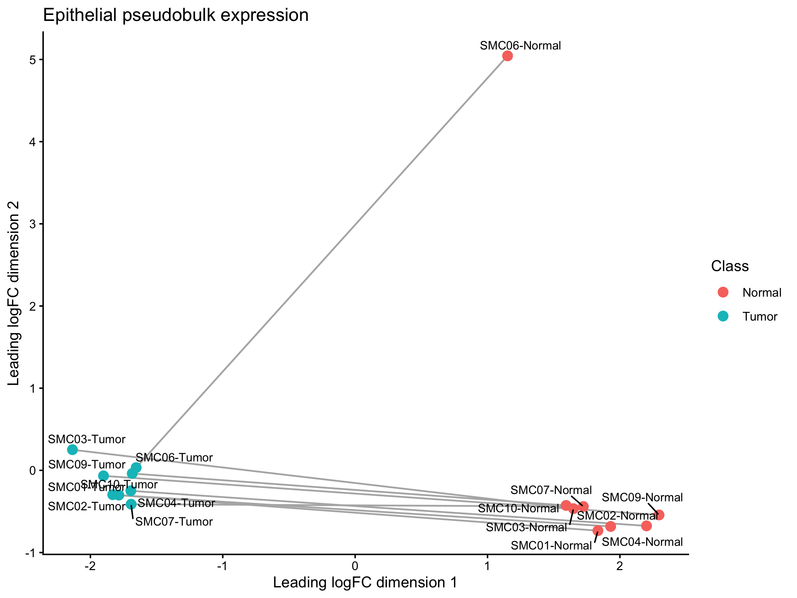{fig-alt="MDS plot of matched epithelial pseudobulk samples." width=75%}

Differential-expression analysis was performed with edgeR using a paired design that included patient identity and tissue class. Genes were classified as significant when the false-discovery rate was below 0.05 and the absolute log2 fold change was at least 1.

A total of 1,141 genes were upregulated in tumor epithelial samples and 1,110 genes were downregulated.

{fig-alt="Volcano plot showing epithelial tumor-versus-normal differential expression." width=80%}

```{r}
de_results <- read.csv(
  "results/epithelial_tumor_vs_normal_edger.csv",
  stringsAsFactors = FALSE
)

top_de <- de_results[
  order(de_results$FDR),
  c(
    "gene",
    "logFC",
    "logCPM",
    "FDR",
    "significance"
  )
]

top_de <- head(top_de, 15)

top_de$logFC <- round(top_de$logFC, 2)
top_de$logCPM <- round(top_de$logCPM, 2)
top_de$FDR <- format(
  top_de$FDR,
  scientific = TRUE,
  digits = 3
)

knitr::kable(
  top_de,
  caption = "Top epithelial tumor-versus-normal differentially expressed genes."
)
```

Genes associated with differentiated intestinal epithelial functions, including `AQP8`, `GUCA2B`, `CLCA4` and `TMIGD1`, were reduced in tumor samples. In contrast, genes including `ETV4`, `CRNDE`, `FXYD5`, `PHGDH` and `LY6E` were increased in tumor samples.

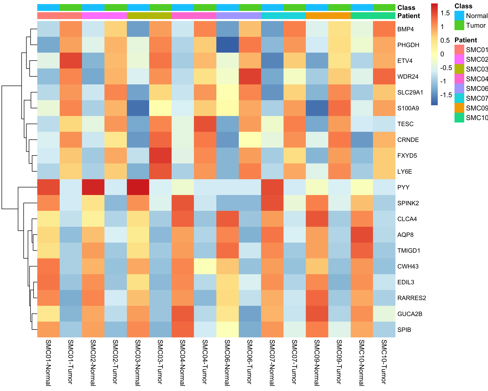{fig-alt="Heatmap of top epithelial tumor-versus-normal differentially expressed genes across matched pseudobulk samples." width=85%}

Because all epithelial cells were aggregated together, these differences may reflect both transcriptional regulation within epithelial populations and changes in the relative abundance of epithelial subtypes.

# Hallmark pathway enrichment

A ranked gene-set enrichment analysis was performed using the MSigDB Hallmark collection. Positive normalized enrichment scores indicate enrichment in tumor epithelial samples, whereas negative scores indicate enrichment in normal epithelial samples.

{fig-alt="Significantly enriched Hallmark pathways in epithelial tumor-versus-normal analysis." width=90%}

Tumor epithelial samples showed enrichment of proliferation and growth-associated programs, including MYC targets, E2F targets and mTORC1 signaling. They also displayed enrichment of glycolysis, DNA repair, unfolded-protein response, interferon-response programs and an epithelial–mesenchymal-transition-associated signature.

Normal epithelial samples were enriched for fatty-acid-metabolism-related programs. The enrichment results describe coordinated gene-expression signatures and should not by themselves be interpreted as direct measurements of pathway activity.

# Conclusions

This analysis identified substantial cellular and transcriptional differences between matched colorectal tumor and normal tissues.

The principal findings were:

1. Major immune, stromal and epithelial populations were reproducibly separated by unsupervised dimensionality reduction and clustering.
2. Tumors showed higher relative proportions of epithelial and myeloid cells and lower proportions of several normal-associated stromal and immune populations.
3. Epithelial tumor samples displayed loss of differentiated intestinal epithelial expression programs.
4. Tumor-associated epithelial programs included MYC, mTORC1, E2F, glycolysis, DNA repair, interferon responses and an EMT-associated signature.
5. Paired patient-level pseudobulk analysis provided a statistically appropriate framework for avoiding the treatment of individual cells as independent biological replicates.

# Limitations

Several limitations should be considered:

- Cell-type proportions are affected by tissue dissociation and capture efficiency.
- Broad epithelial pseudobulk analysis cannot completely distinguish within-cell-state regulation from changes in epithelial subtype composition.
- Harmony integration and UMAP are useful for visualization and clustering but do not establish biological causality.
- Cell-type annotation was based on broad canonical markers and did not attempt detailed immune or epithelial subtype classification.
- The analysis is observational and requires experimental validation.

# Reproducibility

The analysis was performed in R using Seurat, Harmony, edgeR, fgsea, msigdbr, ggplot2 and associated packages. Individual analysis stages are provided as numbered scripts in the project repository. Random seeds were fixed where applicable to improve reproducibility.

The complete workflow progresses from raw-data inspection through sparse-matrix conversion, quality control, dimensionality reduction, annotation, paired compositional analysis, pseudobulk differential expression and pathway enrichment.