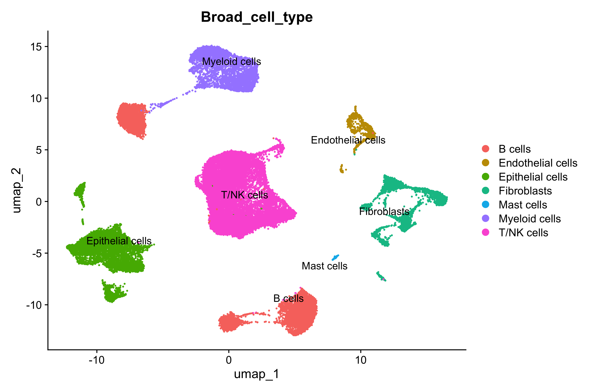
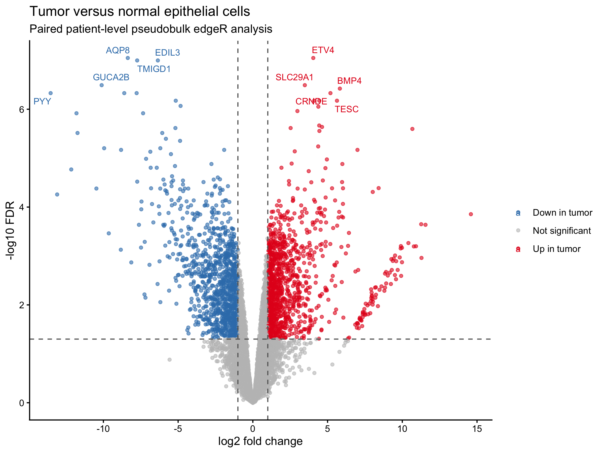
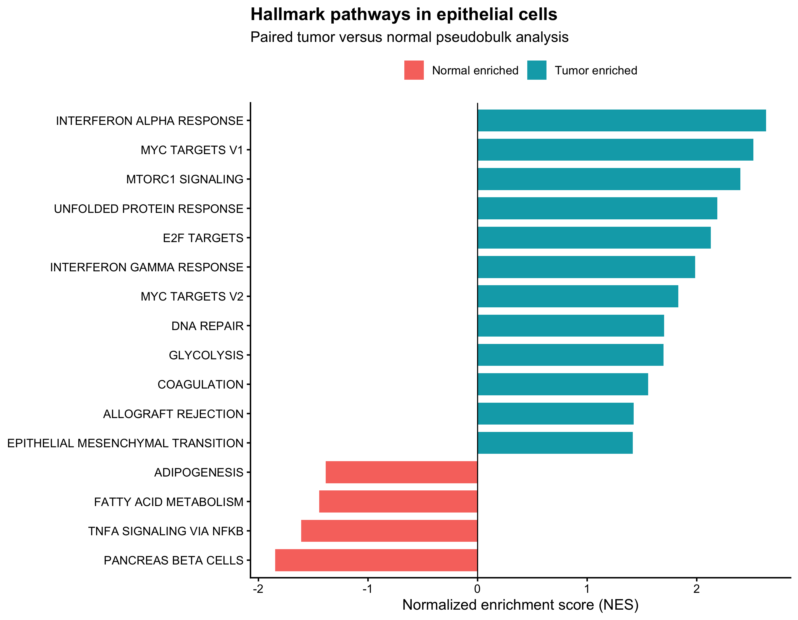

# Single-Cell RNA-seq Analysis of Colorectal Cancer

A reproducible analysis of matched normal and tumor colorectal tissue using the publicly available single-cell RNA-sequencing dataset [GSE132465](https://www.ncbi.nlm.nih.gov/geo/query/acc.cgi?acc=GSE132465).

This portfolio project examines cellular heterogeneity, tumor-associated changes in cell-type composition, and transcriptional differences in epithelial cells.

> This is an independent portfolio reanalysis of a publicly available single-cell RNA-sequencing dataset, developed to demonstrate a reproducible scRNA-seq workflow and biological interpretation. The analysis begins with a processed raw UMI count matrix rather than FASTQ files and is not presented as novel research or as a reproduction of the original authors' complete analysis.

## Dataset

GSE132465 contains single-cell 3′ RNA-sequencing data from 23 primary colorectal tumors and 10 matched normal mucosa samples.

For paired analyses, I selected the ten patients with both normal and tumor samples:

- 39,197 cells
- 16,404 normal cells
- 22,793 tumor cells
- 33,694 genes in the selected raw count matrix

The analysis starts from the processed raw UMI count matrix and cell-level annotation supplied through GEO. FASTQ alignment and Cell Ranger processing are outside the scope of this project.

## Analytical workflow

1. Inspection of the raw UMI count matrix and metadata
2. Selection of ten matched normal–tumor patient pairs
3. Memory-efficient conversion of the dense matrix to sparse Matrix Market format
4. Quality-control assessment
5. Log normalization and highly variable gene selection
6. Principal component analysis
7. Patient-level Harmony batch correction
8. Graph-based clustering and UMAP visualization
9. Broad cell-type annotation using canonical markers
10. Paired cell-type composition analysis
11. Epithelial patient-level pseudobulk aggregation
12. Paired differential-expression analysis with edgeR
13. Hallmark pathway enrichment analysis with fgsea

## Cell-type landscape

Seven broad cell populations were identified using canonical markers:

- B cells
- T/NK cells
- Myeloid cells
- Mast cells
- Epithelial cells
- Endothelial cells
- Fibroblasts



## Main findings

### Cell-type composition

Paired patient-level comparisons indicated:

- Higher relative proportions of epithelial and myeloid cells in tumors
- Lower relative proportions of B cells, fibroblasts, endothelial cells and mast cells in tumors
- No significant paired change in the T/NK-cell proportion after multiple-testing correction

These measurements represent relative proportions among captured cells and may be influenced by tissue dissociation and cell-capture efficiency.

### Epithelial differential expression

Epithelial cells were aggregated into patient-level pseudobulk samples. Patients were included only when both conditions contained at least 20 epithelial cells, resulting in eight matched normal–tumor pairs.

A paired edgeR model including patient identity and tissue class identified:

- 1,141 genes upregulated in tumor epithelial samples
- 1,110 genes downregulated in tumor epithelial samples

Tumor epithelial samples showed reduced expression of differentiated intestinal epithelial genes, including `AQP8`, `GUCA2B`, `CLCA4` and `TMIGD1`. Genes including `ETV4`, `CRNDE`, `FXYD5`, `PHGDH` and `LY6E` were increased in tumor samples.



### Pathway enrichment

Hallmark gene-set enrichment identified tumor-associated enrichment of:

- MYC targets
- mTORC1 signaling
- E2F targets
- Interferon-alpha and interferon-gamma responses
- Glycolysis
- DNA repair
- Unfolded protein response
- An epithelial–mesenchymal-transition-associated signature



## Important analytical decisions

- Patient rather than tissue class was used as the Harmony batch variable to reduce patient-specific variation while retaining the normal–tumor comparison.
- Individual cells were not treated as independent biological replicates in the main differential-expression analysis.
- Raw epithelial counts were aggregated by patient and condition before paired edgeR analysis.
- Both members of a patient pair were excluded when either condition contained fewer than 20 epithelial cells.
- Pathway enrichment was performed using a ranked list of all tested genes rather than only significant genes.

## Repository structure

```text
01–12_*.R                    Numbered R analysis scripts
convert_to_sparse.py         Dense-to-sparse matrix conversion
figures/                     Main analysis figures
results/                     Statistical results and summary tables
CRC_single_cell_report.qmd   Source of the complete Quarto report
CRC_single_cell_report.html  Self-contained HTML report
session_info.txt             R and package version information
```

Large raw data files and intermediate Seurat objects are excluded from the repository.

## Reproducing the analysis

1. Download the cell annotation and raw UMI count matrix from [GSE132465](https://www.ncbi.nlm.nih.gov/geo/query/acc.cgi?acc=GSE132465).
2. Place the decompressed files in `data/raw/`.
3. Run `01_inspect_data.R` and `02_read_annotation.R`.
4. Run the sparse conversion:

```bash
python3 convert_to_sparse.py
```

5. Run the remaining R scripts in numerical order.

The main R packages used are:

- Seurat
- Matrix
- harmony
- dplyr
- ggplot2
- patchwork
- edgeR
- fgsea
- msigdbr
- pheatmap

Package and system versions are recorded in `session_info.txt`.

## Limitations

- The analysis begins from a processed UMI count matrix rather than raw sequencing reads.
- Cell-type proportions are affected by tissue dissociation and capture efficiency.
- Broad epithelial pseudobulk results may reflect both within-cell-state regulation and changes in epithelial subtype composition.
- Broad canonical-marker annotation does not resolve detailed immune or epithelial subtypes.
- The findings are observational and require independent experimental validation.

## Report

The complete analysis, figures, methods and interpretation are available in:

- [`CRC_single_cell_report.qmd`](CRC_single_cell_report.qmd)
- [`CRC_single_cell_report.html`](CRC_single_cell_report.html)
